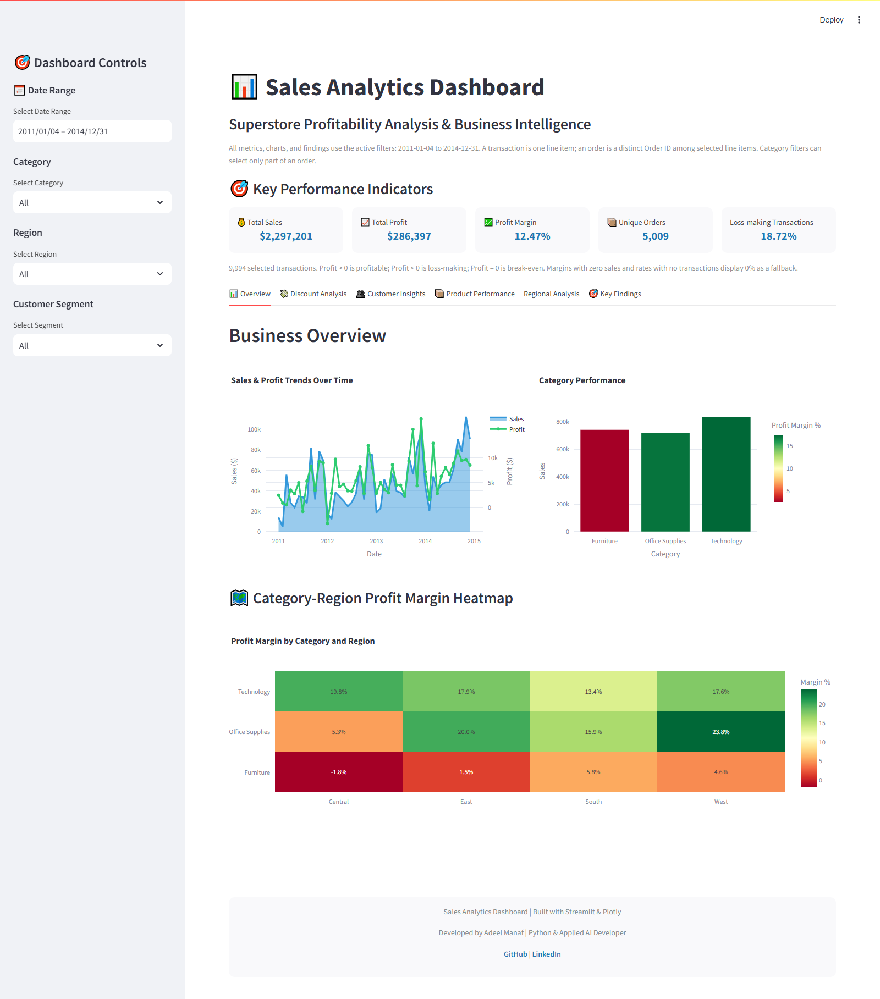

# Superstore Sales Analytics Dashboard

A Streamlit dashboard for exploring sales, transaction profitability, customer
profit concentration, product performance, and regional patterns.

Built by **Adeel Manaf — Python & Applied AI Developer**.

> 🚀 **Live Dashboard:** https://supserstore-dashboard.streamlit.app/

This project focuses on reproducible analytics, transparent metric definitions,
and evidence-based interpretation using the public Sample Superstore dataset.

It reports historical observations only and does not claim realized savings,
causal effects, or forecasted financial impact.

---

## Dashboard



The dashboard contains six interactive sections:

- Overview
- Discount Analysis
- Customer Insights
- Product Performance
- Regional Analysis
- Key Findings

Date, category, region, and customer-segment filters update the analysis dynamically.

---

## Key Findings

Using the full supplied dataset:

- **96.77%** of transactions with discounts of 25% or more were unprofitable.
- Observed gross loss exposure within that discount group was **$138,515.24**.
- The highest-profit **20% of customers contributed 81.66% of total net profit**.
- **3 of 17 sub-categories** generated negative net profit.
- Q4 generated **$878,412.44 in sales** and **$110,731.33 in net profit**, with a **12.61% margin**.

These are historical descriptive findings, not forecasts or recoverable-savings estimates.

Detailed definitions, assumptions, and analytical limitations are documented in
[docs/METHODOLOGY.md](docs/METHODOLOGY.md).

---

## Tech Stack

- **Python**
- **Streamlit**
- **pandas**
- **NumPy**
- **Plotly**
- **pytest**
- **Ruff**
- **Git / GitHub**

---

## Architecture

```text
streamlit_app.py          Streamlit UI, filters, tabs, and rendering
src/data.py               Data loading, validation, and filtering
src/analytics.py          Reusable analytical calculations
src/charts.py             Plotly visualizations
src/insights.py           Evidence-based findings generation

tests/                    Automated analytics and app tests


## Verification

The project includes automated checks for analytics and application behavior.

- **27 automated tests passed**
- Ruff checks passed
- Python compilation passed
- README findings matched production calculations
- All six dashboard sections were browser-tested

Run the checks with:

```bash
python -m pip install -r requirements-dev.txt
python -m pytest -q
python -m ruff check streamlit_app.py src tests scripts
python scripts/report_findings.py --check
```

---

## Run Locally

```bash
git clone https://github.com/adeelmanaf43/Superstore-Sales-Analytics-Dashboard.git
cd Superstore-Sales-Analytics-Dashboard

python -m venv .venv
```

### Windows

```bash
.venv\Scripts\activate
```

### macOS / Linux

```bash
source .venv/bin/activate
```

Install dependencies and start the dashboard:

```bash
python -m pip install -r requirements.txt
streamlit run streamlit_app.py
```

---

## Data & Limitations

This project uses the public **Sample Superstore dataset**.

The analysis is descriptive and does not establish causal effects of discount
policies, pricing decisions, customer incentives, or product strategy.

The **25% discount threshold** is a descriptive analytical cutoff, not an
experimentally established optimal policy.

Historical losses should not be interpreted as automatically recoverable savings.

For detailed metric definitions, assumptions, and validation rules, see
[docs/METHODOLOGY.md](docs/METHODOLOGY.md).

---

## Author

**Adeel Manaf**  
Python & Applied AI Developer

- [LinkedIn](https://linkedin.com/in/adeel-manaf)
- [GitHub](https://github.com/adeelmanaf43)
scripts/                  Reproducibility and browser-check utilities
docs/METHODOLOGY.md       Metric definitions and analytical limitations
assets/                   Dashboard screenshots and styling
