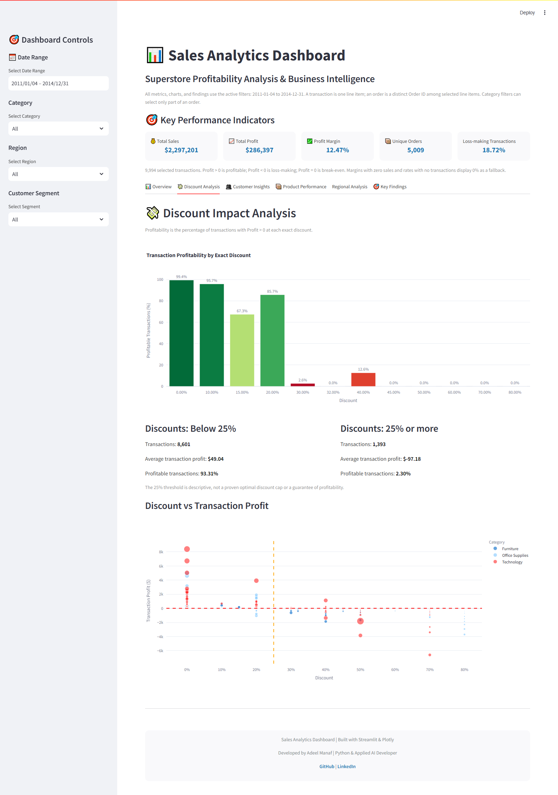

# Superstore Sales Analytics Dashboard

A Streamlit dashboard for exploring sales, transaction profitability, customer
profit concentration, product performance, and regional patterns. Built by
**Adeel Manaf — Python & Applied AI Developer**.

This portfolio project emphasizes reproducible analytics and clear definitions.
It reports historical observations from the supplied Sample Superstore data;
it does not claim realized savings or forecast a policy's financial impact.

## Dashboard


Six sections: **Overview**, **Discount Analysis**, **Customer Insights**,
**Product Performance**, **Regional Analysis**, and **Key Findings**.
Date, category, region, and customer-segment filters update every section.

## Run locally

Use Python 3.10 or newer (validated locally with Python 3.13).

```bash
python -m venv .venv
# Windows: .venv\Scripts\activate
# macOS/Linux: source .venv/bin/activate
python -m pip install -r requirements.txt
streamlit run streamlit_app.py
```

Keep `superstore_cleaned.csv`, `src/`, and `assets/dashboard.css` in the repository.
Paths are resolved from the code location, so launching from another directory
with an absolute entry-point path also works. The data cache expires after ten
minutes. No secrets, database, or external services are required. For Streamlit
Community Cloud, select **streamlit_app.py** as the entry point.

The included Streamlit configuration uses polling for file-change detection to
avoid a native watchdog thread incompatibility observed on Windows/Python 3.13.
Hot reload remains available.

## Reproducible findings

The text below is generated from the same functions used by the app's Key
Findings tab. It refers to the **full dataset**; interactive findings respond to
the user's selection. Run `python scripts/report_findings.py --check` to verify
that these statements still match the supplied data and production code.

<!-- findings:start -->
Full supplied dataset: **2011-01-04 to 2014-12-31**; **9,994 transactions**, **5,009 unique orders**.

Total sales: **\$2,297,200.86**. Total profit: **\$286,397.02**. Profit margin: **12.47%**.

### Discounts and observed losses

1,348 of 1,393 transactions with discounts of 25% or more were unprofitable (96.77%). Observed gross loss exposure: \$138,515.24. Net profit across all transactions in this discount group: \$-135,376.06. These are historical amounts for the selected data, not recoverable savings. Review discount policies alongside product mix and costs; association does not establish causation.

### Customer profit concentration

The highest-profit 159 of 793 customers (the rounded-up Top 20% group) contributed \$233,885.47 in selected-period net profit. This is 81.66% of total net profit. Negative-profit customers can make this share exceed 100%.

### Product profitability

3 of 17 selected sub-categories have negative net profit. Review their pricing and costs. These records do not establish that selling loss-making products causes later purchases or preserves future revenue.

### Quarterly performance

Quarterly comparisons pool the selected years and use total profit / total sales. Q4 sales were \$878,412.44, with net profit of \$110,731.33 and a 12.61% margin. No change in profit from a future discount policy is estimated.
<!-- findings:end -->

## Metric definitions

- A **transaction** is one row; an **order** is a distinct `Order ID`. Filters may
  include only some line items in an order.
- **Profitable transaction rate** = rows with `Profit > 0` / all selected rows
  in the discount group × 100. Loss-making uses `Profit < 0`; zero-profit rows
  are break-even. The chart includes every exact discount, including zero.
- **Observed gross loss exposure** = `-sum(Profit)` for rows where
  `Discount >= 0.25` and `Profit < 0`. Group **net profit** includes all rows at
  `Discount >= 0.25`. Neither estimates recoverable profit or annual savings.
- **Profit margin** = total profit / total sales × 100. Zero denominators display
  0% with an explicit UI caption; empty selections show a warning.
- **Customer value** means selected-period net profit. Groups use rounded-up
  20% and 50% rank boundaries, with Customer ID breaking ties. Net-profit shares
  may be negative or exceed 100%; they are N/A when total net profit is nonpositive.
- **Regional sales per order** divides selected sales by distinct selected orders.
  Quarterly margins use summed profit divided by summed sales, not mean margins.



## Architecture

```text
streamlit_app.py                 Page setup, cached loading, filters, tabs, rendering
src/data.py                     Repository-relative loading, validation, filtering
src/analytics.py                Pure KPIs and reusable aggregations
src/charts.py                   Plotly figure construction
src/insights.py                 Dynamic, evidence-based narrative generation
tests/test_analytics.py          Synthetic-data calculation and validation tests
tests/test_app.py                Streamlit tab/filter integration checks
tests/test_charts.py             Negative-profit and zero-sales chart checks
scripts/report_findings.py      Reproduce findings and check README parity
scripts/check_browser.py        Optional browser verification and screenshots
scripts/update_notebook_claims.py Align notebook cells with production calculations
docs/METHODOLOGY.md              Current metric definitions and limitations
assets/dashboard.css            Dashboard typography and styling
.streamlit/config.toml          Portable polling-based hot reload
```

Runtime packages are Streamlit, pandas, NumPy, and Plotly. Development tools live
in `requirements-dev.txt`; notebook-only plotting packages are not deployed.

## Verification

```bash
python -m pip install -r requirements-dev.txt
python -m pytest -q
python -m ruff check streamlit_app.py src tests scripts
python scripts/report_findings.py --check
```

Optional browser verification and screenshot refresh (with the app running):

```bash
python -m pip install playwright
python -m playwright install chromium
python scripts/check_browser.py
```

Pure analytics tests require no UI rendering. Integration tests use Streamlit's
AppTest to execute all six tabs and exercise combined, empty, and incomplete-date
filters. See the [analytical methodology](docs/METHODOLOGY.md) for definitions,
validation rules, and interpretation boundaries.

Validated locally: **27 tests passed**, Ruff checks passed, Python compilation
passed, and README findings matched production calculations. Chromium rendered
all six tabs without page errors; a category-filter change was checked against
the source CSV. Updated screenshots were visually inspected. The live deployment
has not been changed by this refactor.

## Data and limitations

`Superstore.csv` is the supplied raw source; `superstore_cleaned.csv` is the supplied
notebook export. The app validates and recomputes metrics from source columns,
ignoring unused derived fields. The analysis notebook calls the production
analytics functions, uses corrected transaction terminology, and contains no saved
outputs. Only the current dashboard screenshots are retained. The raw CSV remains
unchanged.

This is descriptive sample-data analysis. It does not establish causal effects
of discounts, acquisition incentives, loyalty policies, or loss leaders. Selected
customer histories are not lifetime forecasts, and partial periods are not
equally exposed seasonal comparisons. The 25% threshold is a named descriptive
cutoff, not an experimentally established optimum. See the methodology document
for validation scope and the complete caveats.

## Author

[Adeel Manaf on LinkedIn](https://linkedin.com/in/adeel-manaf) ·
[GitHub](https://github.com/adeelmanaf43)
